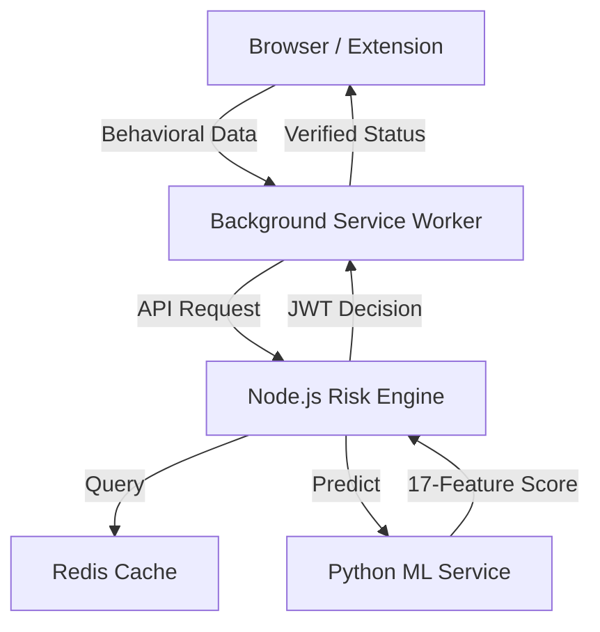

# SilentShield: AI-Powered Passive Human Verification

SilentShield is a multi-layered security system designed to distinguish between human users and automated bots through non-intrusive behavioral analysis. By analyzing unique interaction patterns like mouse movements, typing cadence, and scroll behavior, SilentShield provides a seamless verification experience without the friction of traditional CAPTCHAs.

## 🌟 Key Features
- **17-Feature Behavioral Model**: Uses a Logistic Regression ML model to analyze sophisticated interaction "fingerprints."
- **Passive Verification**: No user interaction required for initial verification; works entirely in the background.
- **Fail-Safe Fallback**: Includes a "Press and Hold" manual verification UI if the AI confidence is low.
- **Enterprise Architecture**: 
  - **Chrome Extension (V3)**: High-performance tracking with a CSP-bypassing Background Service Worker.
  - **Node.js Risk Engine**: Modular API for high-throughput decision making and JWT token issuance.
  - **Python ML Service**: Flask-based intelligence layer delivering real-time predictions.
  - **Redis Caching**: Optimized pre-verification check to reduce ML load.

## 🏗️ Architecture


## 🚀 Getting Started

### 1. Prerequisites
- Node.js (v16+)
- Python (3.9+)
- MySQL
- Redis

### 2. Backend Setup
```bash
cd backend
npm install
# Configure your .env file with DB and Redis credentials
npm start
```

### 3. ML Service Setup
```bash
cd predict
python -m venv venv
venv\Scripts\activate
pip install -r requirements.txt
python app.py
```

### 4. Chrome Extension Setup
1. Open Chrome and navigate to `chrome://extensions/`.
2. Enable **Developer mode** (top right).
3. Click **Load unpacked** and select the `frontend` directory of this project.

## ⚙️ Configuration
The system is highly configurable via environment variables in the `backend/.env` file:
- `JWT_SECRET`: Security key for token signing.
- `ML_SERVICE_URL`: URL of the Python prediction service.
- `REDIS_URL`: Connection string for the Redis cache.

## 🛡️ Security Note
SilentShield uses a Background Service Worker to perform API requests, ensuring compatibility with sites having strict Content Security Policies (CSP). All human-verified sessions are protected by signed JWT tokens.

## 👥 Contributors
Developed as a high-performance security layer for modern web applications.
